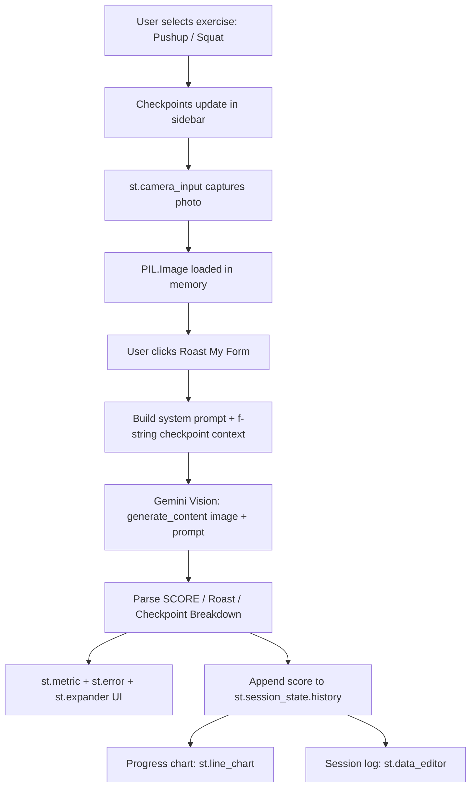

# `>` System Design — RepJudge

### Data flow, module breakdown, and API strategy behind the Gemini Vision form coach

---

## `>` 1. Overview

A single-page Streamlit app that captures a starting-posture photo,
sends it to **Gemini Vision** for biomechanical analysis, and renders
a score, roast, and corrective breakdown — with session-level
progress tracking.

 

## `>` 2. Data Flow

 

## `>` 3. Logic Modules

| Module | Responsibility |
|:---|:---|
| `CHECKPOINTS` dict | Maps each exercise to its 5 biomechanical checkpoints — drives both the sidebar display and the Gemini prompt |
| **Camera capture block** | `st.camera_input` gathers the photo; `PIL.Image.open` converts it for the API |
| `analyze_form()` | Builds the system instruction + dynamic f-string prompt, calls Gemini Vision with the image, parses the structured response into score / roast / breakdown |
| **Results block** | Renders `st.metric` (score + qualitative delta), `st.error` (roast), `st.expander` (checkpoint breakdown) |
| **History block** | Appends each attempt to `st.session_state.history`; renders a line chart of score trend and an editable session log via `st.data_editor` |

 

## `>` 4. API Integration Strategy

| Decision | Why |
|:---|:---|
| **Vision, not text-only** | The premise requires reasoning over actual pixel-level posture cues — elbow angle, hip height, spine curve — which no text prompt alone can evaluate |
| **Fixed system instruction** | Locks Gemini into a consistent "blunt coach" persona so tone doesn't drift between requests |
| **Dynamic f-string context** | Injects the exercise-specific checkpoint list so Gemini evaluates the *right* things per exercise, not generic fitness advice |
| **Structured output contract** | Enforces `SCORE:` + fixed section headers so the app parses responses into UI components without regex guesswork |
| **Graceful degradation** | Missing key, unresolved model, or a failed API call all return a clear in-UI message instead of crashing the app |

 

## `>` 5. Reliability & Error Handling

- The Gemini API call is wrapped in a `try/except`; any failure (timeout, quota, transient API error) surfaces as a readable warning in the results panel instead of a runtime traceback
- Model resolution runs a **diagnostics check** at startup — it queries which models the configured key can actually access and picks the best available match, rather than assuming a hardcoded name will always exist
- No terminal errors reach the deployed app under normal or degraded API conditions

 

## `>` 6. Security Note

The Gemini API key is read from environment variables / `st.secrets`,
**never hardcoded**. `.streamlit/secrets.toml` is gitignored;
`secrets.toml.example` is committed instead as a template with a
placeholder value.

 

## `>` 7. Deployment

Streamlit Community Cloud, connected directly to the GitHub `main`
branch. `requirements.txt` is pinned to exact versions confirmed
against the deployed environment, with no local/system-only
dependencies. Camera access runs entirely client-side through the
browser, so no server-side webcam dependency is needed.

---

Part of the **RepJudge** capstone · [README](./README.md) · MirAI School of Technology

