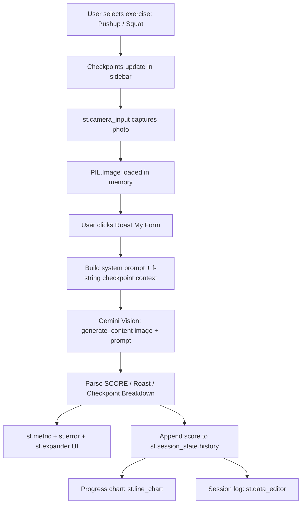

# System Design — Roast My Form

## 1. Overview

A single-page Streamlit app that captures a starting-posture photo,
sends it to Gemini Vision for biomechanical analysis, and renders a
score, roast, and corrective breakdown — with session-level progress
tracking.

## 2. Data Flow

## 3. Logic Modules

| Module | Responsibility |
|---|---|
| `CHECKPOINTS` dict | Maps each exercise to its 5 biomechanical checkpoints, driving both the sidebar display and the Gemini prompt |
| Camera capture block | `st.camera_input` gathers the photo; `PIL.Image.open` converts it for the API |
| `analyze_form()` | Builds the system instruction + dynamic f-string prompt, calls Gemini Vision with the image, parses the structured response into score/roast/breakdown |
| Results block | Renders `st.metric` (score + qualitative delta), `st.error` (roast), `st.expander` (checkpoint breakdown) |
| History block | Appends each attempt to `st.session_state.history`; renders a line chart of score trend and an editable session log via `st.data_editor` |

## 4. API Integration Strategy

- **Why Vision, not text**: the whole premise requires the model to reason
  over actual pixel-level posture cues (elbow angle, hip height, spine
  curve) — a text-only prompt can't do this, which is why this problem
  earns full multimodality credit under the AI Integration rubric.
- **System prompt**: locks Gemini into a consistent "blunt coach" persona
  so tone doesn't drift between requests.
- **Dynamic context via f-strings**: the exercise-specific checkpoint list
  is injected into the prompt so Gemini evaluates the *right* things for
  a squat vs. a pushup, rather than giving generic fitness advice.
- **Structured output contract**: the prompt enforces a strict
  `SCORE:` / `### The Roast` / `### Checkpoint Breakdown` format so the
  app can reliably parse the response into UI components instead of
  dumping raw text.
- **Graceful degradation**: with no `GEMINI_API_KEY` set, the app returns
  a clear placeholder instead of crashing, keeping the UI demoable.

## 5. Security Note

The Gemini API key is read from environment variables / `st.secrets`,
never hardcoded. `.streamlit/secrets.toml` is gitignored;
`secrets.toml.example` is committed instead as a template.

## 6. Deployment

Streamlit Community Cloud, connected directly to the GitHub `main` branch.
`requirements.txt` is pinned to versions available on Cloud's default
Python image, with no local/system-only dependencies. Camera access runs
entirely client-side through the browser, so no server-side webcam
dependency is needed.
